# Wazuh SIEM Homelab: Single-Node Detection Lab

End-to-end SOC detection lab: official Wazuh single-node Docker stack (4.14.8)
plus a Dockerized Ubuntu victim. Attack it, collect the logs, fire a stock
rule, then write and validate a custom detection (MITRE T1110.001).

Full write-up: [`report/main.pdf`](report/main.pdf) (same content as below, with all screenshots).

```
attacker (host) --> victim-ubuntu (sshd, agent)
victim-ubuntu --auth.log--> manager:1514
manager --filebeat--> indexer:9200 --> dashboard:443
```

## 1. Build: single-node stack

Followed the official single-node Docker guide: cloned `wazuh-docker`,
generated indexer certificates with the `wazuh-certs-generator` container,
started with `docker compose up -d`. Host (Arch, 8 GB RAM) already exceeded
the indexer memory-map requirement; ports 443/9200/1514/1515 free. First boot
~2 min; cluster health `green`, one node.

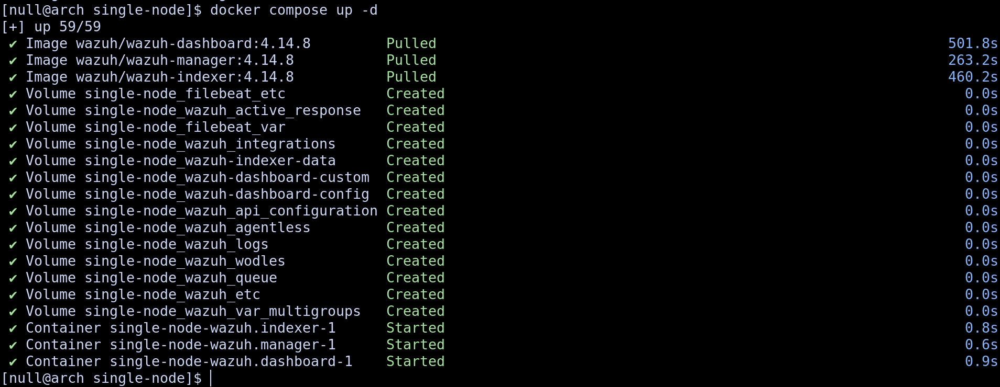


## 2. Victim enrollment

Victim = `ubuntu:22.04` container `victim-ubuntu` on network
`single-node_default` (manager hostname resolves). Installed Wazuh agent
4.14.8 + OpenSSH. Fixed the agent's placeholder `MANAGER_IP` in
`ossec.conf`; enrollment is passwordless (`use_password=no`), so
`agent-auth -m wazuh.manager -A victim-ubuntu` was enough. Manager lists it
as `ID 001, Active`.

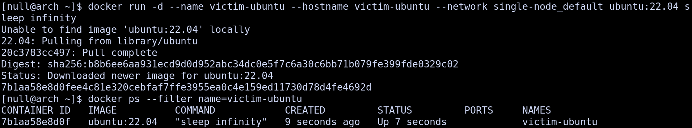
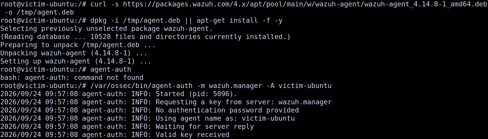
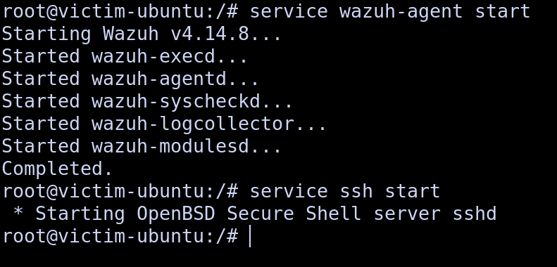
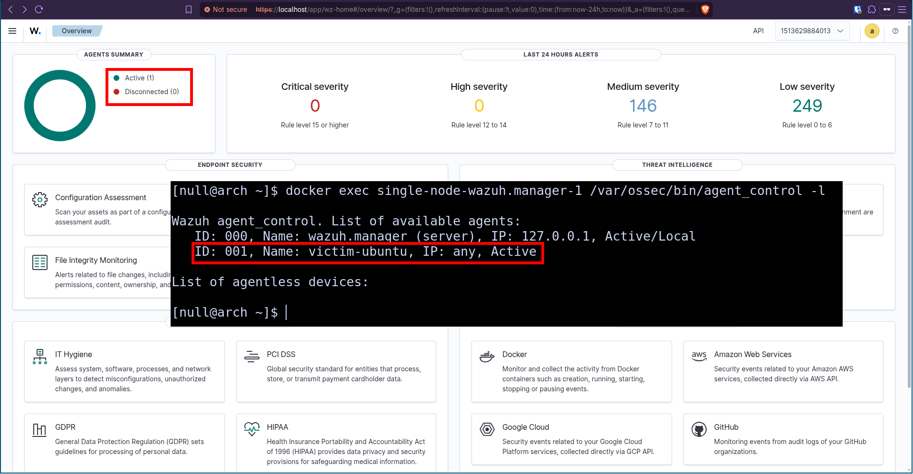

## 3. Problem: missing auth logs

First brute force produced **no alerts**. The attack reached the victim
(orphaned `sshd` processes at attack time) but was logged nowhere: no syslog
daemon in the container, so no `/var/log/auth.log`, and the agent's
`journald` source reads nothing without systemd. Fix: install rsyslog, run
`rsyslogd` directly (no init system, so `service rsyslog start` has no
script; the `imklog` warning is harmless), add to agent `ossec.conf`:

```xml
<localfile>
  <log_format>syslog</log_format>
  <location>/var/log/auth.log</location>
</localfile>
```

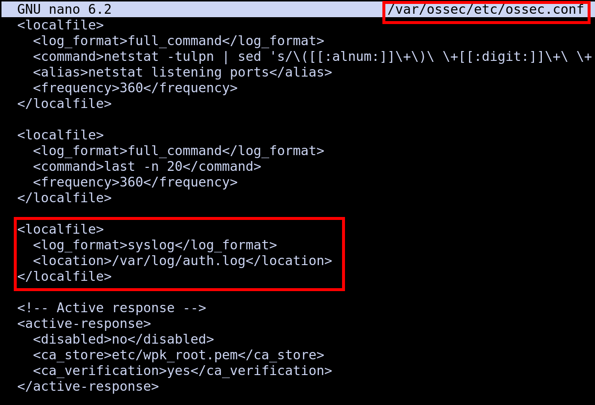

## 4. Detection 1: stock rule

Minimal password loop from the host against the victim IP:

```bash
for i in 1 2 3 4 5 6 7 8; do
  sshpass -p x ssh -o StrictHostKeyChecking=no fakeuser@VICTIM_IP exit
done
```

Each `Failed password for invalid user` fires stock rule **5710** (level 5),
not generic 5716, because the message names an invalid user. PAM failures
fire **5503**; bursts also trip stock aggregate **5551** (level 10).

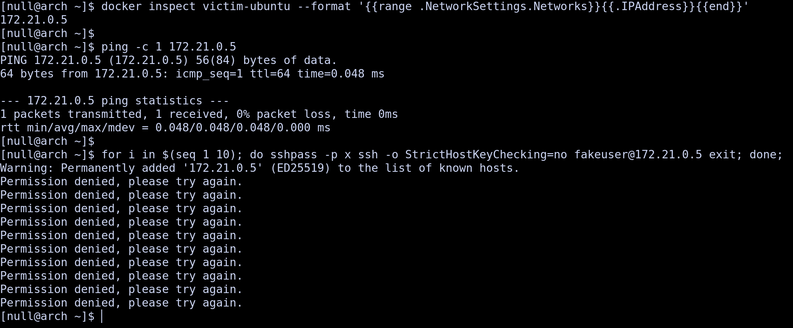
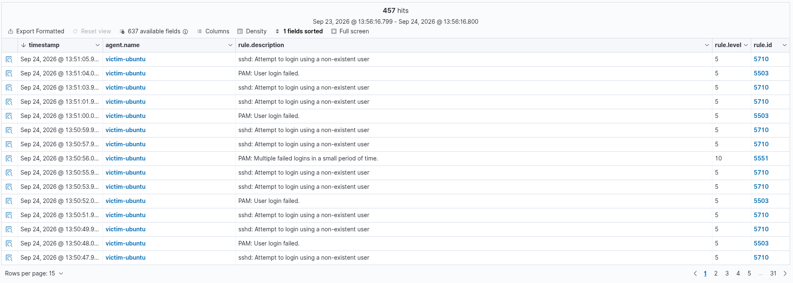
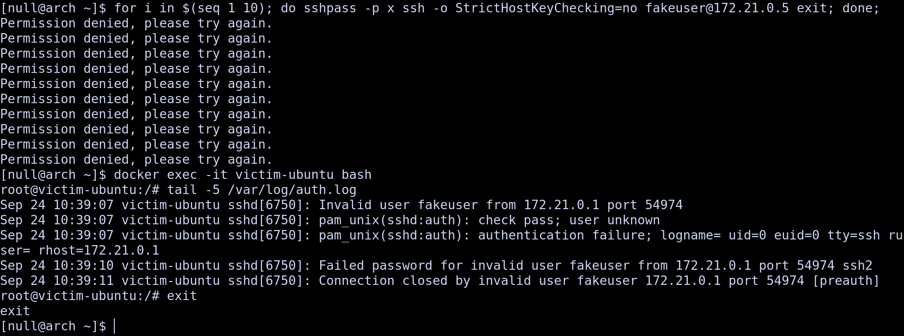

## 5. Detection 2: custom rule 100100

Per-attempt L5 is noise; the signal is the aggregate: 5 failures / 60 s at
level 10. Created in dashboard editor
(Management → Rules → Files → `local_rules.xml`):

```xml
<group name="homelab,">
  <rule id="100100" level="10" frequency="5" timeframe="60">
    <if_matched_sid>5710</if_matched_sid>
    <description>SSH brute force, 5 fails in 60s</description>
    <mitre><id>T1110.001</id></mitre>
  </rule>
</group>
```

Two syntax failures first, both caught by `wazuh-analysisd -t` (warning
7615, rule ignored): comma-plus-space list, then spaceless list.
`if_matched_sid` takes exactly **one** ID, so the final rule watches 5710
only. After manager restart + fresh brute force, 100100 fired at level 10
(4 hits in the test window).

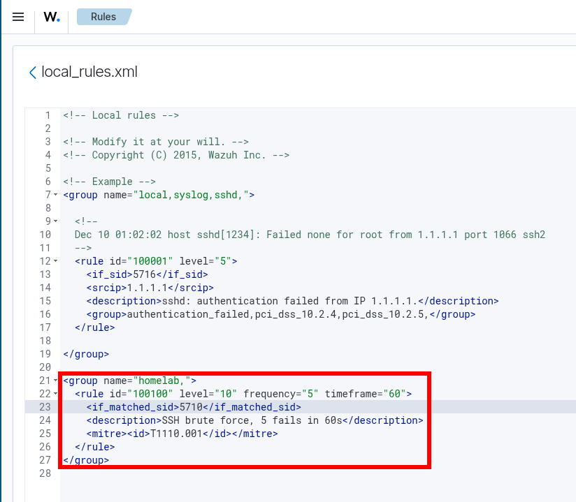
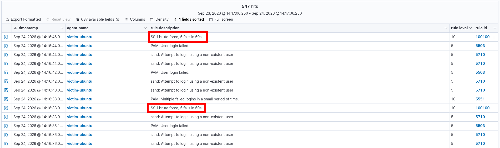
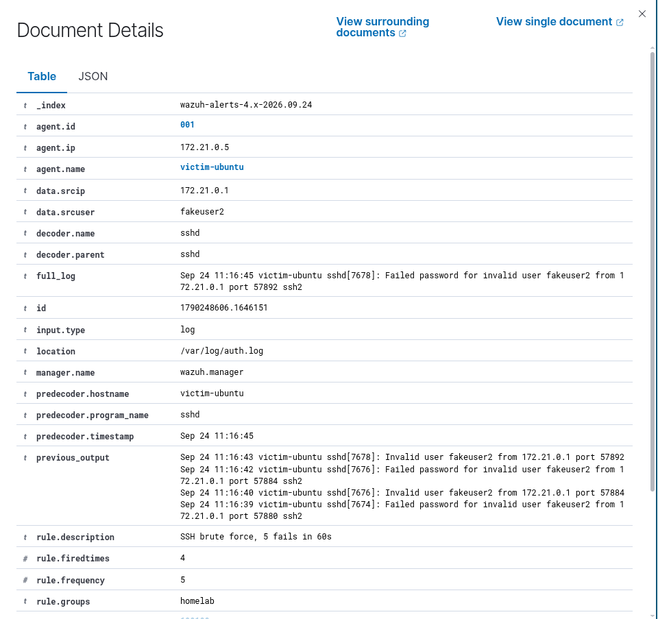

## Threshold rationale and false positives

**Why 5 in 60s:** a human mistypes ~1–3 passwords, then succeeds or stops;
scripted guessing does dozens per minute. 5 catches automation fast in a
quiet lab without flagging one fat-fingered session. Stock sshd aggregate
(5712) uses 8 in 120s — stricter, tuned for busy servers; 5/60 validates
faster against a near-zero baseline. Rule source: [`detections/local_rules.xml`](detections/local_rules.xml).

**Known false positives:**
- Legit user retrying 5× in a minute (wrong layout, expired password) → L10 on a human. Mitigate with an allowlist for known users/hosts, or correlate with a subsequent successful login.
- Automation with a stale key (ansible/CI, monitoring logins) retrying on schedule. Mitigate by allowlisting automation source IPs.
- **Scope flaw (accepted in lab):** the rule has no `<same_source_ip />`, so the count is global — 5 users failing once each across 5 hosts would fire it. Fine with one victim; production needs per-source scoping.
- **No `ignore` window:** a sustained brute emits one alert per 5 events (we saw 4 in one run). Add `ignore="60"` after tuning to cut duplicates.

**Tuning loop:** run one week, compare 100100 hits against confirmed incidents, then adjust frequency/timeframe.

## MITRE mapping

| Rule | Event | Technique |
|------|-------|-----------|
| 5710 | Invalid-user SSH login failure (stock) | T1110.001 |
| 5503 | PAM authentication failure (stock) | T1110.001 |
| 5551 | Multiple failed logins, small period (stock) | T1110.001 |
| 100100 | 5 SSH failures in 60s (custom) | T1110.001 |

## Reproduce

```bash
# stack (from wazuh-docker/single-node)
docker compose -f generate-indexer-certs.yml run --rm generator
docker compose up -d
# victim
docker run -d --name victim-ubuntu --hostname victim-ubuntu \
  --network single-node_default ubuntu:22.04 sleep infinity
# ...agent install + enroll + rsyslog as in §2-3, then attack as in §4
```

## Next steps

FIM on victim `/etc`, active-response block on brute-force sources, second
scenario (unauthorized `sudo`), Windows agent for cross-platform coverage.

---
Full PDF version in [`report/`](report/).